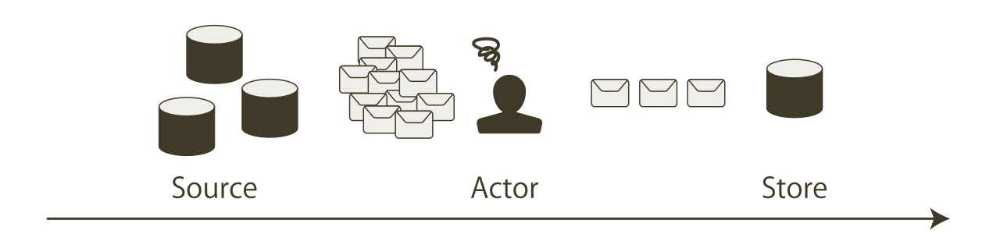
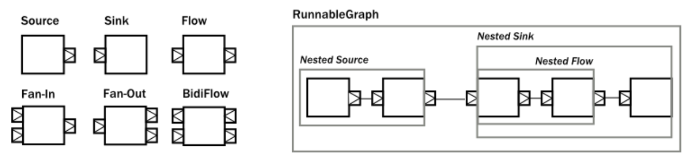

<!-- page_number: true -->
<!-- $size: 16:9 -->
<style>
body.slide-view .markdown-body, body.to-pdf .markdown-body {
  font-size: 26px;
}
.markdown-body li+li {
  margin-top: 0;
}
.markdown-body .highlight pre, .markdown-body pre {
  padding: 5px 16px;
}
</style>

# グラフを知って理解するAkka Stream

###### 2017-04-27 by @kamijin_fanta / Scala関西勉強会 ナイトセミナー

---

## 自己紹介

- Twitter: @kamijin_fanta (青いアイコン)
- 普段はフロント・IoTっぽいバックエンド・インフラ
- Scala, C#, JS, TS, Python, Golang 

---

## ストリーム処理で面倒なこと

- ストリームの処理を手軽に行いたい
  - ビッグデータの解析をする時に全部メモリに載せれない
  - OutOfMemory…
- アクターモデルで実装すると不便な点がいくつか有る
  - バッファ(メールボックス)がオーバーフローしないように注意が必要
  - 型安全ではない



---

## AkkaStreamの特徴

- Akkaを使用したストリーム処理ライブラリ
- ReactiveStreamsに準拠したライブラリと接続が可能
- ノンブロッキング
- バックプレッシャーにより、バッファ溢れが起こらない
- 部品を組み合わせて処理フローを作成する

---

## 用語

- Element
  - AkkaStreamでの処理の単位
  - バッファサイズ等もバイト数ではなくエレメントの数を指定する
- Producer (生産者)
  - データを送信する側
- Consumer (消費者)
  - データを受信する側
- Back-pressure
  - フロー制御の一種
  - Consumerのメッセージ消費速度に合わせ、Producerが送信量を調整する
- Graph
  - ストリームの処理の記述
  - 部品を組み合わせてエレメントの流れる経路を定義する

---

## 主なグラフの構成要素

- Source
  - 下流からの要求に応じ、エレメントの出力を行う
- Flow
  - 上流からのエレメントを受け取り処理を行い、下流に流す
  - Flowは簡単に実装を行えるように、map/filter等のDSL(エイリアス)が用意されている
- Sink
  - 上流からのエレメントを受け取り、何らかの処理を行う
- Port
  - inlet/outletが有る
  - Sourceならoutletが1つ　Sinkならinletが1つ　Flowならoutlet,inlet各1つ
- FanIN / FanOUT
  - 複数のストリームに分岐・結合する
  - 今回は触れない

SourceとSinkが接続された閉じたグラフの事をRunnableGraphと言う

---

## 部品を組み合わせてグラフを作る



- 接続する各ポートの型は一致する必要が有る

http://doc.akka.io/docs/akka/2.5/scala/stream/stream-composition.html

---

## Materialized values

- in/outのポートをすべて使用しているグラフをRunnableGraphと呼ぶ
- 閉じたグラフとグラフの外部との通信手段がMaterializedValue
- 例えば…
  - Source: Source.actorRef
    - Actorでtell(送信)した値がSourceの値として使われる
    - グラフの外からActorRefを受け取り、Sourceと通信する
  - Flow: KillSwitches.single
    - 外部からストリームを終了する
    - 終了をコールするためのオブジェクトを受け取り、外部から終了させる
  - Sink: Sink.fold
    - 処理エレメント数等のストリームを集計する処理を記述
    - ストリーム終了後に値を受け取る

---

## Materialized values - combiner (混合器)


- Materialized Valueの取捨選択を行う
  - Right(上流側)・Left(下流)・Both(両方)
  - Materialized ValueはMatとして略される
  - NotUsedとして使用されないMatも多い


combiner: http://pimages.solidsignal.com/CP2532_medlrg.jpg
http://doc.akka.io/docs/akka/current/scala/stream/stream-composition.html

---

## 実装例1 - Basic

```scala
val src = Source(1 to 5)
val doubleFlow = Flow[Int].map(x => x * 2)
val printSink = Sink.foreach(println)

val runnableGraph = src via doubleFlow to printSink

runnableGraph.run()

Thread.sleep(100)
system.terminate()
```

```
2
4
6
8
10
```

- 1~5のSourceを作り、Intを2倍するFlowを経由し、printlnするSinkに行く
- How/Whatの分離が出来ていて綺麗・再利用しやすい
  
---

## 実装例2 - Materialized values

```scala
val src: Source[Int, NotUsed] = Source(1 to 20)
val primeFilterFlow: Flow[Int, Int, NotUsed] = Flow[Int].filter {
  case i if (i <= 1) => false
  case i if (i == 2)  => true
  case i => !(2 to (i-1)).exists(x => i % x == 0)
}
val collectIntSink: Sink[Int, Future[Set[Int]]] =
  Sink.fold(Set[Int]()){ case (a, b) => a + b }

val runnableGraph: RunnableGraph[Future[Set[Int]]] =
  (src via primeFilterFlow toMat collectIntSink)(Keep.right)

val future: Future[Set[Int]] = runnableGraph.run()
future.onComplete {
  case x =>
    println(x)
    system.terminate()
}
```

```scala
Success(Set(5, 13, 2, 17, 7, 3, 11, 19))
```

- 1から20の数字の中の素数を判定し、setとして返す
- Graphの外と通信刷るためにMaterialized valuesを使用している

---

## テスト例

```scala
val primeFilterFlow: Flow[Int, Int, NotUsed] = Flow[Int].filter {
  case i if (i <= 1) => false
  case i if (i == 2)  => true
  case i => !(2 to (i-1)).exists(x => i % x == 0)
}

val testSrc = Source(1 to 20)
val probe = testSrc
  .via(primeFilterFlow)
  .toMat(TestSink.probe[Int])(Keep.right)
  .run()
probe.request(8)
probe.expectNext(2, 3, 5, 7, 11, 13, 17, 19)
```

- 各パーツの実装が単純なので、テストも容易
- testkitが用意されている

---

## 提供されているSource/Sink

- 標準提供
  - Source.tick
  - FileIO
  - TCP, TLS
- alpakka
  - AMQP, MQTT
  - AWS Lambda, DynamoDB, S3
  - https://github.com/akka/alpakka
- Akka Streams Kafka
  - Akka Streamsの分散を行いたい場合に使うことも多い
  - http://doc.akka.io/docs/akka-stream-kafka/current/home.html
- Reactive Streams
  - Slick
  - elasticsearch

---

## 基本的な動作の仕組み

1. Sinkが上流にPull(エレメントの要求)する 
2. FlowがPullを受け取り上流にPullを受け流す
3. SourceがPullを受け取り、エレメントをPushする
4. FlowがエレメントのPushを受け取り、必要な処理を行い下流にPushする
5. SinkがエレメントのPushを受け取り、必要な処理を行い1に戻る


http://doc.akka.io/docs/akka/current/scala/stream/stream-customize.html

---

## Flowの動作 - map


- Pushでエレメントを受け取る
- エレメントに関数を適用する
- 下流にPushする

---

## Flowの動作 - filter


- Pushでエレメントを受け取る
- エレメントに関数を適用する
- 戻り値が…
  - trueなら下流にPushする
  - falseなら上流に再度Pullを送る

---

## Mapをグラフとして実装

```scala
class MapFlow[In, Out](val fn: In => Out) extends GraphStage[FlowShape[In, Out]] {
  private val in = Inlet[In]("in")
  private val out = Outlet[Out]("out")

  override val shape = FlowShape(in, out)

  override def createLogic(attr: Attributes) = new GraphStageLogic(shape) {
    setHandler(in , new InHandler {
      override def onPush(): Unit = push(out, fn(grab(in)))
    })
    setHandler(out , new OutHandler {
      override def onPull(): Unit = pull(in)
    })
  }
}
```

```scala
val src = Source(1 to 5)
val double = (x: Int) => x * 2
val doubleFlow = Flow.fromGraph(new MapFlow(double))
val printSink = Sink.foreach(println)

val runnableGraph = src via doubleFlow to printSink
runnableGraph.run()
```

---

## 基本的な動作の仕組み

1. Sinkが上流にPull(エレメントの要求)する 
2. FlowがPullを受け取り上流にPullを受け流す
3. SourceがPullを受け取り、エレメントをPushする
4. FlowがエレメントのPushを受け取り、必要な処理を行い下流にPushする
5. SinkがエレメントのPushを受け取り、必要な処理を行い1に戻る


http://doc.akka.io/docs/akka/current/scala/stream/stream-customize.html

---

## 学習方法

- 公式ドキュメント
  - これ読むだけでマスター！という事にはならないけど、大変良い資料
  - http://doc.akka.io/docs/akka/current/scala/stream/index.html
- APIリファレンス
  - DSLと実装(impl)に分かれている
  - 割りとコードは読みやすい(ﾓﾅってない)
  - http://doc.akka.io/api/akka/current/akka/stream/

---

# ご清聴ありがとうございました

###### 2017-04-27 by @kamijin_fanta / Scala関西勉強会 ナイトセミナー

